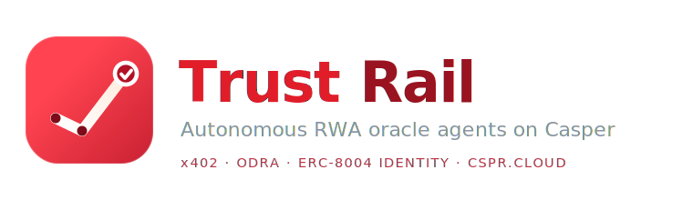

<p align="center">
  
</p>

<h1 align="center">Trust Rail: Autonomous RWA Oracle Agents on Casper</h1>

> Casper Agentic Buildathon 2026 entry. **`casper-trust-rail`**

**✅ Live on Casper testnet** all three contracts deployed (`casper-test`). Addresses + explorer transactions in **[DEPLOYED.md](DEPLOYED.md)**:
`AgentIdentity` `hash-50de6c75…03de` · `Reputation` `hash-d66a18fa…27ba` · `RwaOracle` `hash-7a131614…514b`

Casper's manifest calls it _"the trust layer for the agent economy."_ Trust Rail is that thesis made real: an **autonomous AI agent that publishes verified real-world-asset data on-chain to Casper** with a **verifiable on-chain identity**, an **accuracy-based reputation** that the chain enforces, **sanctions screening** and a **cryptographic attestation** on every post, and **pay-per-read settlement over Casper-native x402**.

The reference asset is **tokenized US T-bill / treasury yields**, but the rail is asset-agnostic.

```
fetch → risk-assess → sanctions-screen → attest → post on-chain → confirm → (later) score → reputation
```

## Why this wins on the rubric

| Judging criterion                 | How Trust Rail hits it                                                                                                                                                                                                         |
| --------------------------------- | ------------------------------------------------------------------------------------------------------------------------------------------------------------------------------------------------------------------------------ |
| **Working smart contracts** | Three Odra contracts (`agent_identity`, `reputation`, `rwa_oracle`) **live on Casper testnet** ([addresses + txs](DEPLOYED.md)), with cross-contract reputation gating and 9 passing Rust unit tests.                                                                      |
| **Use of AI / Agentic**     | An autonomous loop: fetch → LLM+heuristic risk assessment → decide post/flag/escalate → attest → post → self-score. The LLM can only_raise_ risk severity, never lower the deterministic floor.                           |
| **Innovation**              | Reputation-gated, attestation-bound RWA oracle. Each on-chain value carries the SHA-256 of the signed policy verdict that authorized it, a consumer can verify_why_ a number was posted, by whom, and with what track record. |
| **Real-world (DeFi & RWA)** | Posts treasury yields a DeFi protocol can consume via a paid`consume` entry point; x402 makes it machine-to-machine commerce.                                                                                                |
| **Technical execution**     | Self-contained, no private deps. 34 tests green, clean `tsc`, CJS+ESM+DTS build, full offline demo.                                                                                                                      |
| **Long-term plans**         | Veridex is a real, pilot-ready product with socials, "we're bringing our agent trust rail to Casper" is a credible launch story, not a weekend throwaway.                                                                     |

## Architecture

```
┌─────────────────────────── TrustRailAgent ──────────────────────────────┐
│  TBillDataSource ──▶ RiskAssessor ──▶ Sanctions ──▶ PolicyAttestation   │
│  (off-chain RWA)     (LLM+heuristic)  (fail-closed)  (signed verdict)   │
│         └────────────────────────────────────────────────┐              │
│                                                  CasperClient           │
└────────────────────────────────────────────────────────┬────────────────┘
                                                         │ casper-js-sdk / CSPR.cloud
                       ┌─────────────────────────────────┼───────────────────────────┐
                       ▼                                 ▼                           ▼
              AgentIdentity (Odra)              Reputation (Odra)            RwaOracle (Odra)
              register / owner_of               record_outcome / score_of   post_data_point / consume
                                                          ▲                           │
                                                          └────── reputation gate ◀────┘
                                            x402: CasperX402Facilitator (/verify, /settle) for paid reads
```

### On-chain (`contracts/`, Odra / Rust)

- **`agent_identity`** — binds a human-readable `agent_id` to the Casper account that controls it (verifiable identity).
- **`reputation`** — accuracy score in basis points, moved by an authorized updater; starts neutral (5000).
- **`rwa_oracle`** — accepts a data point only when the publisher is a registered, reputation-clearing agent; stores the value + `attestation_hash`; serves consumers via a free `latest` view and a paid `consume` entry point (the x402 target).

### Off-chain (`src/`, TypeScript)

- **`casper/`** — `CasperClient` over a `CasperRpc` transport. `MockCasperRpc` (offline/tests) and `RealCasperRpc` (`casper-js-sdk`, optional peer dep).
- **`x402/`** — `CasperX402Facilitator` (`/supported`, `/verify`, `/settle`, `payAndFetch`) and `ExactPaymentSigner` (EIP-712 `exact`-scheme authorization).
- **`oracle/`** — `TBillDataSource`, `RiskAssessor` (heuristic + optional LLM), `ReputationTracker`.
- **`sanctions/`** — `StaticSanctionOracle` / `HttpSanctionOracle`, wrapped by the treasury kit's screener.
- **`attestation/`** — ed25519 signer/verifier for the reused `PolicyAttestation`.
- **`agent/`** - `TrustRailAgent`, the orchestration loop.

## Trust primitives (original, self-contained)

Two small primitives do the heavy lifting and are implemented natively in this
repo no external trust dependencies, fully exercised by tests:

- **`src/attestation/postAttestation.ts`** → `PostAttestation` / `PostAttestationGuard` a signed `allow` verdict bound to the exact value posted (SHA-256 over a canonical `PostIntent`). The intent hash is what we store on-chain as `attestation_hash`, so a value can be matched to the signed verdict that authorized it.
- **`src/sanctions/screener.ts`** → `OracleSanctionScreener` real-time, TTL-cached, **fail-closed** counterparty screening before any post.


## Quick start

```bash
bun install
bun run test          # 34 tests
bun run lint          # tsc --noEmit, clean
bun run demo          # full pipeline, offline against MockCasperRpc
```

`bun run demo` output (abridged):

```
=== 2. Run the oracle pipeline (fetch -> assess -> screen -> attest -> post) ===
   - risk: post (0) within band, deviation and freshness nominal
   - sanctions: clear (oracle[static-denylist])
   - posted: mock0000...
   posted value: 5310000 (5.31% x 1e6)
   attestation hash (on-chain): eb41b80cb8dd8c04708c4b48aa15456ffe6e135d1...
```

## Live deployment (Casper testnet)

All three contracts are **deployed and live** on `casper-test` (Casper 2.0), wired
together at deploy time (the `RwaOracle` holds the `AgentIdentity` + `Reputation`
addresses for its on-chain reputation gate). Full details in **[DEPLOYED.md](DEPLOYED.md)**.

| Contract | Address (contract package hash) | Deploy transaction |
|---|---|---|
| **AgentIdentity** | `hash-50de6c7535ef4196db67904a7c5a6fa5a1d56199e6100edd8c7b042fdf0b03de` | [view ↗](https://testnet.cspr.live/transaction/eb1521e80154f3e6f80b8f93a71c6fbc92b6acf3d2147eb435f82852d2d2f647) |
| **Reputation** | `hash-d66a18fa40dfc17e199bcbde6aff02ade40ffd4fd1b8adfe022c1ba5145427ba` | [view ↗](https://testnet.cspr.live/transaction/c0a4e255437371a7bee458ed7fb87d49590817d68f146748da3940d3d6f6a4bc) |
| **RwaOracle** | `hash-7a1316142309897f674c5be6c86ac3dfa21869c79aa59738716ac480fdee514b` | [view ↗](https://testnet.cspr.live/transaction/07a7eee25eb6bc2aca57ab4ff9a54004e082d066383d851b8cd9abccb494d83c) |

**The agent is live too.** `bun run testnet` runs the TypeScript agent's full
pipeline (fetch → risk → sanctions → attest) and writes on-chain — it has
registered its identity and posted attested T-bill yields to the oracle. Example
agent-driven post: [`post_data_point` ↗](https://testnet.cspr.live/transaction/6881d0a479778ac7e7edf083d899144db8e14ae10d43088627b7e4e22e041260)
(stores `value=5310000`, `attestation_hash=45470551…`). Full list in [DEPLOYED.md](DEPLOYED.md).

## Deploy to testnet

Full step-by-step in **[DEPLOY.md](DEPLOY.md)**. The short version:

```bash
# contracts compile + test on the Odra MockVM (nightly toolchain, pinned via
# contracts/rust-toolchain.toml rustup installs it automatically)
cd contracts && cargo odra test          # 9 passing
cargo odra build                         # -> wasm/*.wasm

# deploy + wire all three contracts in one shot (prints the contract hashes)
# public no-auth node; NODE_ADDRESS has no /rpc (the client appends it)
export ODRA_CASPER_LIVENET_NODE_ADDRESS=https://node.testnet.casper.network
export ODRA_CASPER_LIVENET_EVENTS_URL=https://node.testnet.casper.network/events
export ODRA_CASPER_LIVENET_CHAIN_NAME=casper-test
export ODRA_CASPER_LIVENET_SECRET_KEY_PATH=./keys/secret_key.pem   # funded
cargo run --bin deploy --features livenet

# then drive the agent (registers identity + posts one attested data point)
cd .. && cp .env.example .env            # fill in the printed hashes
bun add casper-js-sdk && bun run testnet
```

The single `post_data_point` deploy satisfies the buildathon's
**transaction-producing on-chain component** requirement.

> Contracts require a **Rust nightly** toolchain (Odra's proc-macros use nightly
> features); `contracts/rust-toolchain.toml` pins it so a clone just works.

## x402 pay-per-read

Downstream consumers pay per oracle read via the CSPR.cloud x402 Facilitator
(`https://x402-facilitator.cspr.cloud`). `CasperX402Facilitator.payAndFetch`
handles the `402 → sign exact-scheme authorization → retry with X-PAYMENT` flow;
`/settle` returns the on-chain settlement hash. Buildathon teams get sponsored
facilitator usage. Wire-compatible with [`make-software/casper-x402`](https://github.com/make-software/casper-x402).


## License

MIT
